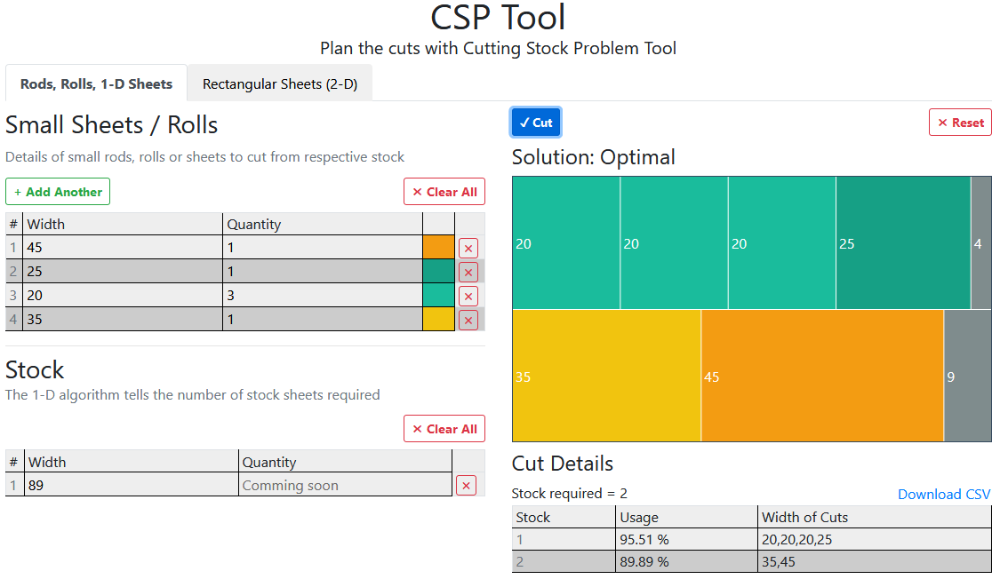
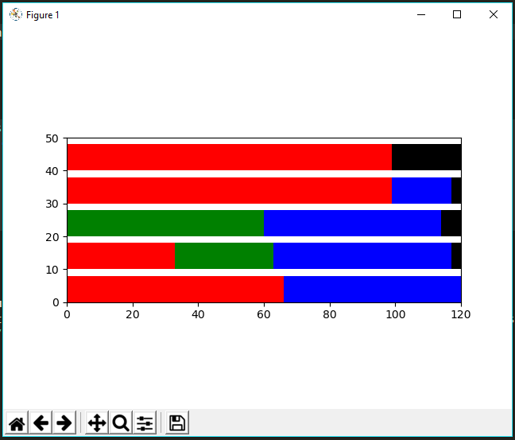

# Cutting Stock Problem
Cutting Stock Problem (CSP) deals with planning the cutting of items (rods / sheets) from given stock items (which are usually of fixed size).

## New to Cutting Stock Problem? Understand Visually
<a href="https://www.youtube.com/watch?v=4WXtfO9JB20">
	
</a>


This implementation of CSP tries to answer
> How to minimize number of stock items used while cutting customer order


while doing so, it also caters
> How to cut the stock for customer orders so that waste is minimum


The OR Tools also helps us in calculating the number of possible solutions for your problem. So in addition, we can also compute
> In how many ways can we cut given order from fixed size Stock?


## Quick Usage
This is how CSP Tools looks in action. Click [CSP Tool](https://emadehsan.com/csp/) to use it
<a href="https://emadehsan.com/csp/">
	
</a>

## Libraries
* [Google OR-Tools](https://developers.google.com/optimization)

## Quick Start
Install [Pipenv](https://pipenv.pypa.io/en/latest/), if not already installed
```sh
$ pip3 install --user pipenv
```

Clone this project and install packages
```sh
$ git clone https://github.com/emadehsan/csp
$ cd csp
$ pipenv install

# activate env
$ pipenv shell
```

## Run
If you run the `stock_cutter_1d.py` file directly, it runs the example which uses 120 as length of stock Rod and generates some customer rods to cut. You can update these at the end of `stock_cutter_1d.py`.
```sh
(csp) $ python csp/stock_cutter_1d.py
```

Output:

```sh
numRollsUsed 5
Status: OPTIMAL
Roll #0: [0.0, [33, 33, 18, 18, 18]]
Roll #1: [2.9999999999999925, [33, 30, 18, 18, 18]]
Roll #2: [5.999999999999993, [30, 30, 18, 18, 18]]
Roll #3: [2.9999999999999987, [33, 33, 33, 18]]
Roll #4: [21.0, [33, 33, 33]]```
```




### Using input file
If you want to describe your inputs in a file, [infile.txt](./infile.txt) describes the expected format

```sh
(csp) $ python3 csp/stock_cutter_1d.py infile.txt
```


## Thinks to keep in mind
* Works with integers only: IP (Integer Programming) problems working with integers only. If you have some values that have decimal part, you can multiply all of your inputs with some number that will make them integers (or close estimation).
* You cannot specify units: Whether your input is in Inches or Meters, you have to keep a record of that yourself and conversions if any.


## CSP 2D
Code for 2-dimensional Cutting Stock Problem is in [`deployment/stock_cutter.py`](deployment/stock_cutter.py) file. The `deployment` directory also contains code for the API server and deploying it on Heroku.

## Resources
The whole code for this project is taken from Serge Kruk's
* [Practical Python AI Projects: Mathematical Models of Optimization Problems with Google OR-Tools](https://amzn.to/3iPceJD)
* [Repository of the code in Serge's book](https://github.com/sgkruk/Apress-AI/)
